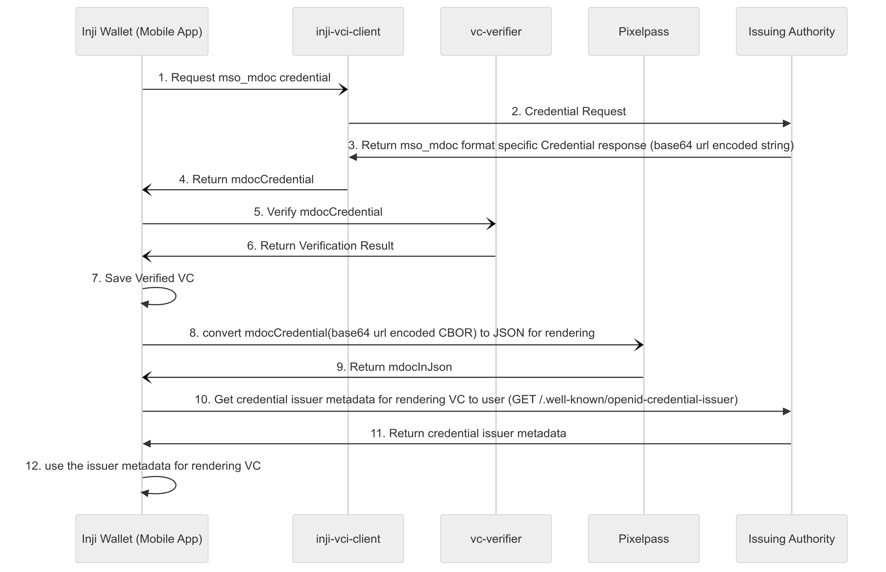

## Support of credential format mso_mdoc

This document focuses on the steps involved for downloading and rendering a mdoc (credential format - mso_mdoc)

### Communication sequence diagram

### Actors involved
1. Inji Wallet
2. Issuing authority
3. [inji-vci-client](https://github.com/mosip/inji-vci-client) (Library for downloading credential)
4. [vc-verifier](https://github.com/mosip/vc-verifier) (library for verification of downloaded VC)
5. [pixelpass](https://github.com/mosip/pixelpass) (In case of mdoc, this library for converting base64 url encoded mdoc credential to JSON for rendering purpose)


#### Steps involved
##### 1. Make credential request

Communicate with inji-vci-client to make the credential request to Issuing authority
````{
   "format": "mso_mdoc",
   "doctype": "org.iso.18013.5.1.mDL",
   "claims": {
      "org.iso.18013.5.1": {
         "given_name": {},
         "family_name": {},
         "birth_date": {}
      },
   },
   "proof": {
      "proof_type": "jwt",
      "jwt": "eyJraWQiOiJkaWQ6ZXhhbXBsZ...KPxgihac0aW9EkL1nOzM"
   }
}
````
##### 2. Receive the credential response
inji-vci-client makes the credential request to issuing authority, once the response is received it returns back the response to the Wallet
```{  
	"credential": "<base-64-url>"  
}  
```
##### 3. Perform vc verification

After receiving the credential from the issuing authority via inji-vci-client library, checking is done reg the VC issued by the issuer has not been changed. For mso_mdoc format VC following checks are performed using vc-verifier library

        * DS (Document Signer) certification validation (certificate chain validation) [As of now this validation is not performed]
        * Cryptographic signature / hash check
        * issuing_country check
        * docType check
        * validity information check
##### 4. Rendering of mso_mdoc VC

- In case of mso_mdoc format VC, issuer provides the credential in base 64 encoded CBOR data. Wallet will be communicating with module pixelpass library to convert base 64 encoded CBOR to JSON data, this processed credential will be used for rendering purpose. 
- This processed credential will be ignored while storing the VC data into storage / sharing via bluetooth to avoid bigger data storage / transmission respectively and will be kept only in state machine context, which avoids communication with pixelpass every time for rendering.
- Post getting the processed VC, the wellknown of the issuer is then used for rendering the labels of the VC and ordering of the fields.
  - Detail view of VC
    - field label -> displaying field name should be from Credential Issuer (Issuing Authority) metadata claims' display attribute ([Reference](https://openid.net/specs/openid-4-verifiable-credential-issuance-1_0-ID1.html#name-credential-issuer-metadata-5))
    - Order of fields -> As per [openID4VCI draft 13](https://openid.net/specs/openid-4-verifiable-credential-issuance-1_0-ID1.html), we can use order property in wellknown, which is an array of claims.display.name values that lists them in the order they should be displayed by the Wallet. eg - org.iso.18013.5.1\~given_name [format - {namespace}~{claim-value-name}]
